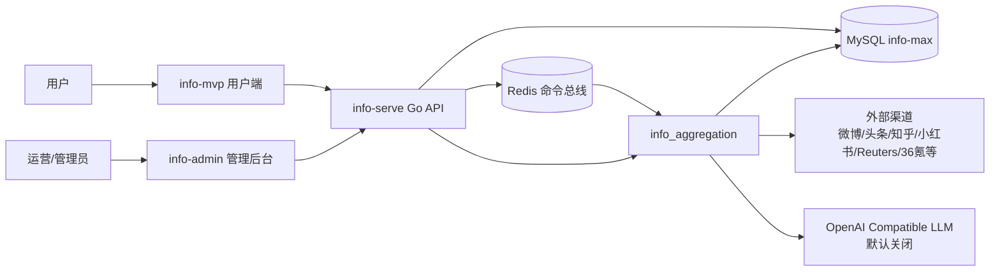
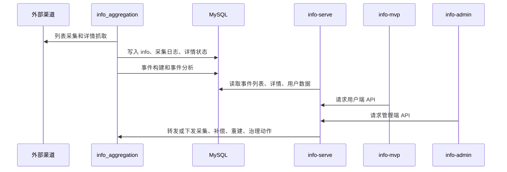

# 信息达人系统架构总览

> 适用版本：v1.0.0 上线候选版  
> 更新时间：2026-05-15

## 架构结论

当前系统由四个应用服务、一个 Redis 命令总线和一个 MySQL 数据库组成。

| 服务 | 技术栈 | 开发端口 | 生产端口 | 职责 |
|---|---|---:|---:|---|
| `info_aggregation` | Python + FastAPI + SQLAlchemy + APScheduler | 8000 | 18000 仅本机映射 | 采集、详情补偿、质量报告、事件分析、LLM 熔断 |
| `info-serve` | Go | 8085 | 8085 | 用户端 API、管理端 API、鉴权、审计、管理动作编排 |
| `info-admin` | Vue3 + TypeScript + Vite | 5174 | 8081 | 管理后台 |
| `info-mvp` | uni-app + Vue3 + TypeScript | 5175 | 8082 | 用户端 H5 和微信小程序 |
| `redis` | Redis 7 | 6379 | 127.0.0.1:16379 | 管理动作命令总线和结果缓存 |
| `mysql` | MySQL 8.x | 3306 | 宿主机或独立数据库 | 业务数据、采集数据、事件分析数据 |

## 服务边界

边界规则：

- `info_aggregation` 负责写入采集、质量和事件分析数据。
- `info-serve` 负责读 MySQL、对外提供 `/api/v1/*`，并统一鉴权和审计。
- `info-admin` 和 `info-mvp` 不直连数据库。
- 生产环境不公网开放 MySQL 和 `info_aggregation`。
- 管理动作优先通过 Redis 命令总线下发，必要时保留 HTTP 内部调用兜底。

## 核心数据流

## 数据质量和展示质量机制

当前系统把质量分成三层：

| 层级 | 目标 | 关键能力 |
|---|---|---|
| 采集质量 | 判断来源内容是否真实、完整、可用 | `detail_score`、`detail_fetch_status`、详情补偿队列、渠道质量报告 |
| 分析质量 | 判断事件分析是否可信、稳定、可追溯 | 规则分析、LLM 增强、结构校验、模型熔断、来源追溯 |
| 展示质量 | 判断事件是否适合进入用户首页 | `display_quality_score`、`display_quality_level`、可信事件/观察中分流 |

弱来源治理原则：

1. 微博、小红书等社交渠道可以提供热度线索，但不能单独包装成确定事实。
2. 无完整事实来源的事件默认进入 `monitoring`。
3. 已有完整事实源时，单个弱来源尾巴不再把事件整体判为风险。
4. 来源质量应通过详情补偿、凭证有效性验证、二跳事实源召回提升。
5. 不通过放宽首页展示门槛来掩盖采集问题。

## 数据库事实来源

当前数据库完整结构和初始化数据以 [../../info_aggregation/sql/mysql8_init.sql](../../info_aggregation/sql/mysql8_init.sql) 为准。

完整 schema 当前包含 27 张表：

- 分类和渠道：`category`、`channel`
- 内容采集：`info`、`info_acquisition_log`、`detail_job`
- 事件和分析：`event`、`event_evolution`、`event_item_link`、`event_timeline_entry`、`event_summary_snapshot`、`event_analysis_run`、`event_analysis_source`、`event_fact_snapshot`、`event_analysis_snapshot`、`event_timeline_analysis`
- 大模型：`llm_model_config`、`llm_call_log`
- 用户和审计：`user_account`、`user_session`、`user_favorite_event`、`user_preference`、`user_read_history`、`admin_audit_log`
- 调度和质量：`crawl_task`、`crawl_run_log`、`data_quality_snapshot`、`rebuild_checkpoint`

## 当前架构风险

| 风险 | 影响 | 控制方式 |
|---|---|---|
| 弱渠道可用率偏低 | 首页可信事件数量受限 | 保持展示门控，持续治理 pending 队列和凭证 |
| MySQL 不由 compose 管理 | 首次部署依赖人工初始化 | 部署手册固定 `mysql8_init.sql` 初始化流程 |
| GitHub Actions 不执行数据库初始化 | 首次上线前仍需人工确认 MySQL 连接和执行脚本 | workflow 只上传 `mysql8_init.sql`，部署前人工执行并复核 |
| 管理动作跨服务 | 排查链路更长 | 通过 Redis 命令结果、审计日志和 aggregation 日志定位 |
