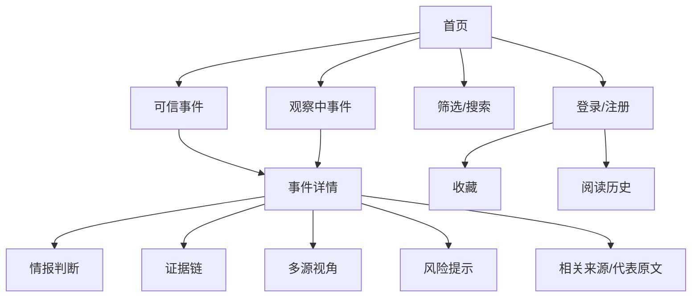
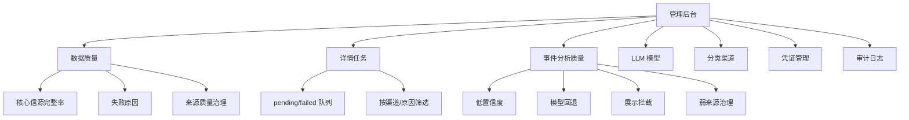

# 信息达人页面与产品设计

> 适用版本：v1.0.0 上线候选版  
> 更新时间：2026-05-15

## 设计目标

信息达人的页面设计围绕“可信热点情报台”展开，不追求普通热榜的信息密度，而是让用户快速判断一件事是否可信、是否重要、是否值得继续关注。

核心设计原则：

1. 首页先给判断，不只给标题。
2. 详情页必须展示证据来源和不确定性。
3. 观察中事件不能像可信事件一样表达。
4. 后台页面要面向治理动作，不做纯展示看板。
5. 弱来源问题要在后台被发现和处理，不能在用户端被包装成确定事实。

## 用户端信息架构

## 首页设计

首页承担“快速判断”的任务。

| 模块 | 设计要求 |
|---|---|
| 可信事件 | 展示标题、一句话判断、可信度、来源数、最新变化 |
| 观察中事件 | 明确说明为什么还不能下结论，如单一弱来源、事实源不足、来源信息不完整 |
| 筛选搜索 | 支持分类、渠道、关键词和排序 |
| 事件卡片 | 不能只展示热度和标题，必须体现情报判断 |

首页不展示：

- 无完整来源的确定性结论。
- 纯社交热度包装成事实。
- 半截标题、半截摘要、原始 metadata。
- 需要用户自行判断来源质量的裸列表。

## 事件详情页设计

详情页承担“看懂和验证”的任务。

| 区块 | 目的 |
|---|---|
| 首屏判断 | 展示标题、一句话判断、质量等级、事件状态 |
| 发生了什么 | 给出结构化事实摘要 |
| 为什么重要 | 解释影响范围和关注价值 |
| 最新进展 | 展示当前进展，不把旧信息当新结论 |
| 风险提示 | 标明未证实、弱来源、争议和不确定性 |
| 证据链 | 展示可用来源、弱来源、来源质量 |
| 多源视角 | 对比不同平台或媒体的叙事差异 |
| 代表原文 | 让用户可以回到来源内容验证 |
| 历史关联 | 展示相关事件或前序事件 |

## 观察中事件表达

观察中事件不是垃圾桶，而是待核实线索池。

| 场景 | 用户端表达 |
|---|---|
| 社交热度高但无事实源 | 已有热度，等待媒体或官方事实源确认 |
| 单一弱来源 | 当前只有单一弱来源，建议观察 |
| 来源不完整 | 来源信息不完整，结论需谨慎 |
| 分析质量不足 | 暂不展示为可信事件 |

## 管理后台信息架构

## 后台治理动作

| 动作 | 入口 | 目的 |
|---|---|---|
| 触发采集 | 渠道/采集任务 | 小批量验证渠道是否可用 |
| 刷新质量 | 数据质量 | 重算采集和展示质量指标 |
| 重抓低完整详情 | 数据质量/详情任务 | 补齐正文和来源信息 |
| 补偿分析弱来源 | 事件分析质量 | 将弱来源事件反向转成详情补偿任务 |
| 重建过期分析 | 事件分析质量 | 补偿成功后刷新事件摘要、事实和展示质量 |
| 来源质量优先治理 | 数据质量/事件分析质量 | 串联弱来源入队、补偿、事实源匹配、重分析和展示刷新 |
| 归档低质/重复 | 数据质量 | 控制低质量内容继续污染事件池 |
| 配置 LLM | LLM 模型 | 接入模型增强分析，并观察成功率和熔断状态 |

## 设计边界

当前版本不做：

- 营销落地页式首页。
- 大而全 BI 面板。
- 社区评论和讨论区。
- 个性化推荐和订阅推送。
- 为了事件数量放宽弱来源进入首页。

## 验收口径

页面设计是否达标，看四件事：

1. 普通用户第一屏能感知这是 AI 情报台，不是普通热榜。
2. 可信事件和观察中事件的表达明显不同。
3. 详情页能看到证据链、风险提示和来源质量。
4. 运营人员能从后台定位问题并触发治理动作。
