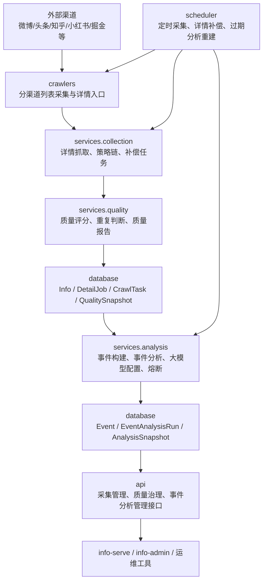
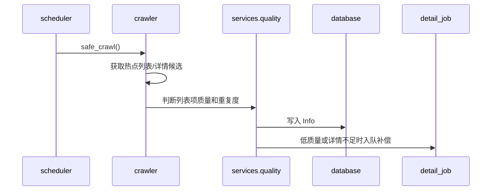
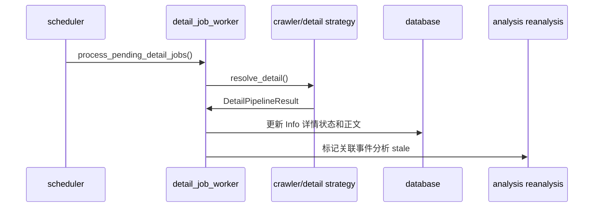
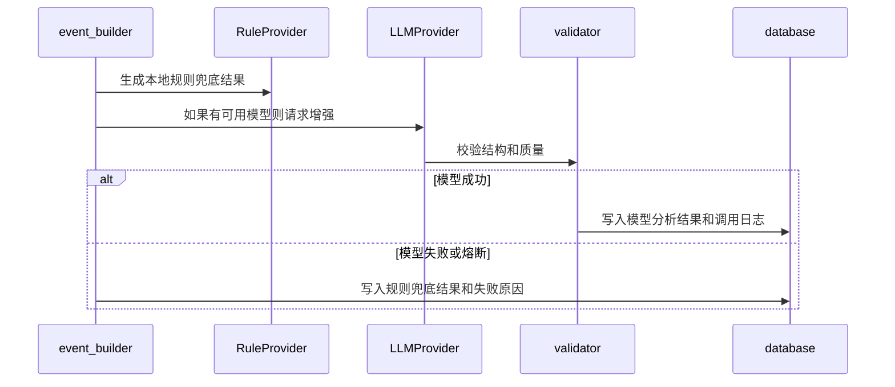

# info-aggregation 系统架构文档

> 版本：v1.0.0
> 日期：2026-05-09
> 服务定位：信息达人数据采集底座与事件分析引擎
> 当前运行方式：开发阶段本地运行，生产阶段容器化部署

---

## 1. 服务定位

`info-aggregation` 是信息达人产品最核心的底座服务，负责把外部渠道的热点、文章、讨论和结构化信息采集回来，并加工成可被用户端消费的事件分析结果。

它的职责分成两条主线：

1. **数据采集线**：抓取列表、二次抓取详情、清洗正文、质量评分、补偿低质量内容。
2. **事件分析线**：把多条内容聚合为事件，生成摘要、事实、时间线、来源对比、价值判断，并支持大模型增强和本地规则兜底。

`info-aggregation` 不负责用户登录、用户收藏、前端展示和管理端权限，这些由 `info-serve`、`info-mvp`、`info-admin` 承担。

---

## 2. 总体架构



核心原则：

- **采集和分析分线**：采集只追求真实、完整、有价值；分析负责把内容变成用户能理解的事件。
- **渠道差异化**：每个渠道可以有自己的 Cookie、入口、详情策略和质量规则。
- **失败可回退**：详情抓取失败进入补偿队列；大模型分析失败自动熔断并回落本地规则。
- **旧路径兼容**：本次架构整理保留历史导入路径，降低部署风险。

---

## 3. 目录结构

```text
info_aggregation/
  main.py                         # 进程入口，只负责调用 application.runtime
  config.py                       # 全局配置，环境变量集中入口

  application/                    # 应用启动与运行期编排
    runtime.py                    # 初始化数据库、注册爬虫、启动调度器和 API
    logging_config.py             # 日志格式、时区、文件/控制台输出
    crawler_bootstrap.py          # 所有渠道爬虫注册

  api/                            # FastAPI HTTP 接口
    __init__.py                   # 当前接口集合，后续可继续拆 routers

  crawlers/                       # 分渠道采集器
    base.py                       # BaseCrawler 和通用 HTTP 能力
    registry.py                   # 爬虫注册中心
    weibo.py                      # 微博
    toutiao.py                    # 今日头条
    xiaohongshu.py                # 小红书
    zhihu.py                      # 知乎
    ...                           # 其他渠道

  services/
    collection/                   # 数据采集线：详情、补偿、凭证、策略链
      credential_provider.py
      detail_pipeline.py
      detail_strategy_chain.py
      http_html_detail_strategy.py
      secondary_search_detail_strategy.py
      detail_jobs.py
      detail_job_worker.py
      detail_replay.py
      acquisition_quality.py

    quality/                      # 数据质量线：质量判断、报告、维护动作
      data_quality.py
      data_quality_report.py
      channel_quality_report.py
      detail_job_report.py
      data_maintenance.py

    analysis/                     # 事件分析线：事件构建、质量治理、LLM 配置
      event_builder.py
      event_analysis_quality_report.py
      event_analysis_quality_actions.py
      event_analysis_reanalysis.py
      llm_model_config.py

    event_analysis/               # 事件分析引擎内核
      schemas.py                  # 分析结果结构
      text_utils.py               # 正文清洗、断句、去噪
      rule_provider.py            # 本地规则兜底分析
      providers.py                # OpenAI Compatible 等模型适配
      validator.py                # 分析结果校验
      pipeline.py                 # 规则 + 大模型 + 回退编排

    enrichment/                   # 数据增强与语义解析
      tech_content_parser.py

  scheduler/                      # APScheduler 调度
    __init__.py                   # due task 扫描、采集、详情补偿、分析重建

  database/                       # ORM 与数据库连接
    models.py                     # SQLAlchemy 模型
    session.py                    # engine/session/init_db

  sql/                            # 数据库脚本
    mysql8_init.sql               # MySQL 8 首版一键初始化脚本
    init_data.py                  # 本地启动初始化入口

  tools/                          # 本地审计与运维工具
  tests/                          # 自动化测试
```

---

## 4. 分层职责

### 4.1 application：启动编排

`application/` 负责进程启动所需的横向能力：

- `logging_config.py`：统一日志时区，避免容器默认 UTC 造成线上排查困难。
- `crawler_bootstrap.py`：注册所有渠道爬虫。
- `runtime.py`：按“数据库初始化 -> 爬虫注册 -> 调度器启动 -> API 启动”的顺序启动服务。

`main.py` 只保留入口和历史兼容导出，避免继续膨胀。

### 4.2 api：接口层

`api/` 是 HTTP 适配层，只做请求参数解析、调用服务、返回 JSON。它不应该直接实现复杂采集、分析或质量规则。

当前接口包含：

- 数据查询与手动采集。
- 渠道和采集任务管理。
- 详情补偿队列管理。
- 数据质量报告。
- 事件分析质量报告。
- 大模型配置管理。

后续如果 `api/__init__.py` 继续增长，按业务拆成：

- `api/routes/crawl.py`
- `api/routes/quality.py`
- `api/routes/events.py`
- `api/routes/llm.py`
- `api/app.py`

### 4.3 crawlers：渠道采集层

`crawlers/` 每个文件对应一个渠道。渠道采集器主要负责：

- 获取热点列表。
- 解析来源 ID、标题、热度、来源 URL。
- 对有条件的渠道发起详情入口解析。
- 调用通用详情质量管线判断正文是否完整。

渠道差异化逻辑应该放在对应 crawler 中，例如：

- 是否需要 Cookie。
- 是否需要二次搜索。
- 是否需要 Playwright/Chromium。
- source_id 如何生成。
- 详情页正文如何提取。

### 4.4 services.collection：数据采集线

采集线处理“怎样把详情抓完整”：

- `credential_provider.py`：读取渠道 Cookie/API Key 等凭证。
- `detail_pipeline.py`：统一评估详情完整度，输出状态、分数、策略和正文长度。
- `detail_strategy_chain.py`：组合多种详情策略，按轻重顺序尝试。
- `http_html_detail_strategy.py`：普通网页详情抓取。
- `secondary_search_detail_strategy.py`：用标题/热词二次搜索详情。
- `detail_jobs.py`：创建补偿任务。
- `detail_job_worker.py`：执行补偿任务并标记事件分析过期。
- `detail_replay.py`：离线回放详情样本。
- `acquisition_quality.py`：从采集角度评估内容完整性和价值性。

### 4.5 services.quality：数据质量线

质量线处理“采集结果是否可用”：

- `data_quality.py`：文本规范化、重复判断、低质量判断。
- `data_quality_report.py`：全局数据质量报告。
- `channel_quality_report.py`：按渠道统计完整度、成功率和治理建议。
- `detail_job_report.py`：详情补偿队列报告。
- `data_maintenance.py`：归档低质量和重复数据、刷新语义字段。

### 4.6 services.analysis：事件分析线

分析线处理“怎样把内容变成事件洞察”：

- `event_builder.py`：将 Info 聚合为 Event，并写入摘要、快照和时间线。
- `event_analysis_quality_report.py`：分析事件质量，如缺失分析、弱来源、低置信度。
- `event_analysis_quality_actions.py`：把低质量分析反向转成详情补偿任务。
- `event_analysis_reanalysis.py`：详情补偿成功后标记并重建过期事件分析。
- `llm_model_config.py`：管理大模型配置、调用次数、调用日志和熔断状态。

### 4.7 services.event_analysis：事件分析引擎

这是事件分析的核心内核：

- 先用规则分析生成稳定兜底结果。
- 如果管理端启用了可用大模型，则调用 OpenAI Compatible Provider 增强分析。
- 对模型输出做结构校验和质量校验。
- 模型失败时记录失败日志并回落规则分析。
- 连续失败达到阈值后熔断模型，避免拖垮事件重建。

### 4.8 services.enrichment：语义增强

`enrichment/` 保存不属于详情抓取、也不属于事件分析的内容增强能力。目前包括科技内容主题、实体、关键词解析。后续财经指标解析、地域识别、人物机构抽取也放这里。

### 4.9 scheduler：调度层

调度器负责把后台任务持续跑起来：

- 同步渠道配置到 `crawl_task`。
- 按 due task 执行采集。
- 执行详情补偿队列。
- 补偿成功后重建过期事件分析。
- 周期性保存采集健康和质量快照。

调度层只负责“什么时候做”，具体“怎么做”调用 `crawlers/` 和 `services/`。

### 4.10 database 与 sql：持久化层

- `database/models.py` 定义 ORM。
- `database/session.py` 定义数据库连接和 session 生命周期。
- `sql/mysql8_init.sql` 是 MySQL 8 完整表结构和首版初始化数据来源。

项目约定：不再使用数据库外键约束，跨表一致性由代码和索引维护。

---

## 5. 核心数据流

### 5.1 采集入库



### 5.2 详情补偿



### 5.3 事件分析



---

## 6. 关键表

### 6.1 采集相关

- `category`：内容分类。
- `channel`：渠道配置、采集间隔和启停状态。
- `crawl_task`：可调度采集任务。
- `crawl_run_log`：采集运行日志；管理后台渠道健康指标由该表实时聚合。
- `info`：采集内容主表。
- `info_acquisition_log`：详情抓取过程日志。
- `detail_job`：详情补偿队列。
- `data_quality_snapshot`：数据质量快照。

### 6.2 事件相关

- `event`：事件主表。
- `event_item_link`：事件与来源内容关联。
- `event_summary_snapshot`：兼容旧接口的摘要快照。
- `event_timeline_entry`：兼容旧接口的时间线。
- `event_analysis_run`：每次事件分析运行记录。
- `event_fact_snapshot`：事实抽取快照。
- `event_analysis_snapshot`：结构化分析快照。
- `event_timeline_analysis`：新版分析时间线。

### 6.3 大模型相关

- `llm_model_config`：多个模型配置、启停、每日调用上限、熔断状态。
- `llm_call_log`：模型调用成功/失败、耗时和错误日志。

---

## 7. 大模型与熔断

事件分析支持两种能力：

1. **本地规则分析**：默认可用，保证系统在无模型时稳定运行。
2. **大模型增强分析**：管理端启用模型后参与分析。

模型选择规则：

- 只选择 `is_enabled=1` 的模型。
- 跳过达到 `daily_call_limit` 的模型。
- 跳过 `circuit_open_until` 未到期的模型。
- 多个模型按 `priority` 从小到大选择。

失败处理：

- 模型失败会写入 `llm_call_log`。
- 连续失败次数写入 `llm_model_config.consecutive_failure_count`。
- 达到 `EVENT_ANALYSIS_LLM_FAILURE_THRESHOLD` 后设置 `circuit_open_until`。
- 当前事件自动使用本地规则分析，不中断事件重建。

---

## 8. 导入规范

服务层已经按业务域拆分完成，旧的平铺兼容入口已删除。新代码必须直接引用新的分层路径：

```python
from services.collection.detail_pipeline import run_detail_pipeline
from services.analysis.event_builder import rebuild_events
from services.analysis.llm_model_config import list_llm_model_configs
```

不要再新增下面这类旧路径导入：

```python
from services.detail_pipeline import run_detail_pipeline
from services.event_builder import rebuild_events
from services.llm_model_config import list_llm_model_configs
```

如果新增业务模块，优先判断它属于 `collection`、`quality`、`analysis`、`event_analysis` 还是 `enrichment`，不要继续在 `services/` 根目录新增业务文件。

---

## 9. 开发规范

新增代码按以下规则放置：

- 新渠道采集器：`crawlers/<channel>.py`
- 详情抓取策略：`services/collection/`
- Cookie/API Key 读取：`services/collection/credential_provider.py`
- 采集完整度和价值性判断：`services/collection/acquisition_quality.py`
- 通用质量规则：`services/quality/data_quality.py`
- 质量报告：`services/quality/`
- 事件构建和事件质量治理：`services/analysis/`
- 大模型配置、调用日志、熔断：`services/analysis/llm_model_config.py`
- 事件分析算法核心：`services/event_analysis/`
- 语义解析和内容增强：`services/enrichment/`
- 数据库模型：`database/models.py`
- 数据库脚本：`sql/`，同时补充必要的 `docs/数据库/` 增量脚本

不建议：

- 在 `api/` 中写复杂业务规则。
- 在 `scheduler/` 中写渠道详情解析。
- 在 crawler 中直接写事件分析逻辑。
- 新增平铺的 `services/*.py` 文件。

---

## 10. 后续架构优化方向

v1.0.0 先完成清晰分层和核心稳定性，后续可以继续推进：

1. 将 `api/__init__.py` 拆成多个 router 文件。
2. 将 `scheduler/__init__.py` 拆成采集调度、详情补偿调度、分析重建调度。
3. 将 `database/models.py` 按领域拆成 `models/content.py`、`models/events.py`、`models/ops.py`，再统一导出。
4. 将渠道配置和详情策略规则配置化，减少 crawler 内硬编码。
5. 建立采集样本回放集，让每个渠道的详情完整度可以持续回归测试。
